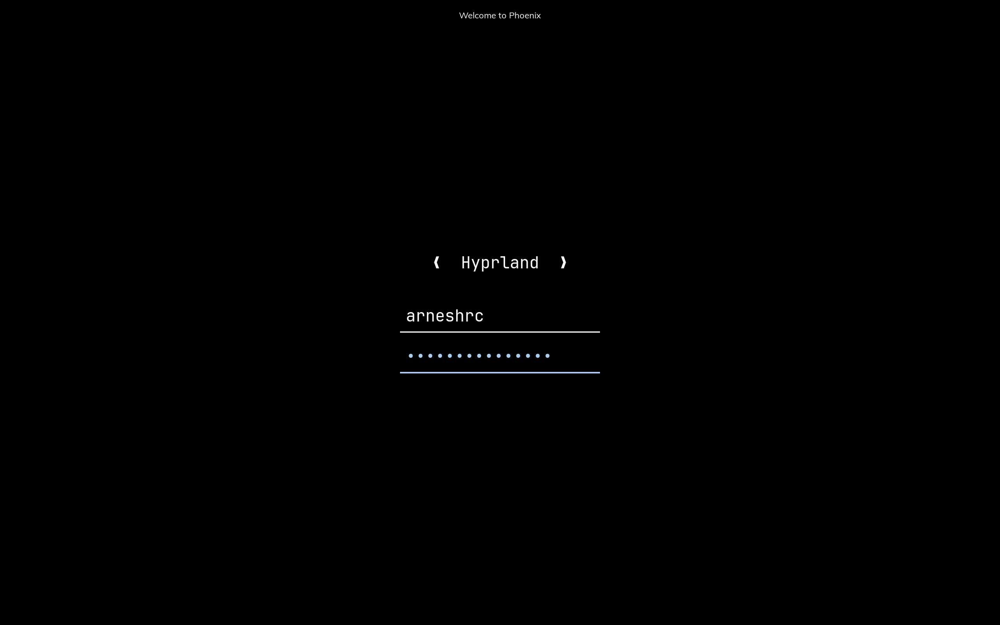

# Minimal Framebuffer Login Manager

"A stupidly simple graphical login manager" based on [deathowl/ddlm](https://github.com/deathowl/ddlm).

Uses framebuffer, so You wont have to run a wayland session to bootstrap your wayland session (unlike gtkgreet)

This is a greetd frontend.

# Prior work:
Continuation/fork of prior work by [deathowl](https://github.com/deathowl/ddlm). This one uses a custom config file, no embedded fonts, and a new, simpler layout.

# Screenshot



# Setup
My greetd config looks like :
```toml
[terminal]
# The VT to run the greeter on. Can be "next", "current" or a number
# designating the VT.
vt = 1

# The default session, also known as the greeter.
[default_session]

command = "mflm" 

# The user to run the command as. The privileges this user must have depends
# on the greeter. A graphical greeter may for example require the user to be
# in the `video` group.
user = "greetd"
```

And my mflm config looks like this:

```toml
[fonts]
heading = "Muli"
main = "JetBrainsMono Nerd Font Mono"
heading_size_px = 22

[colors]
foreground = "#fafafa"
background = "#000000"
neutral = "#cccccc"
selected = "#aaccee"
error = "#ecbcad"

[login]
username = "arneshrc"

[ui]
password_char = "•"
text_align = "left"
input_margin_px = 15

```

# Future plans:
* Add modules on the headline (datetime etc.)
